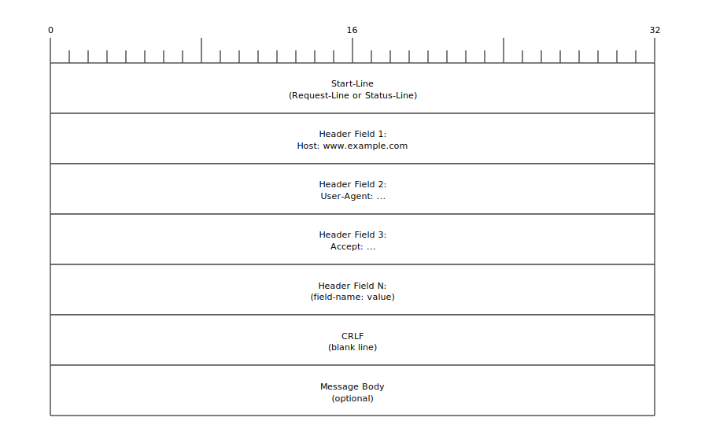

1. Clone `https://github.com/tbocek/qotp` locally
2. Clone `qh` repo and run `go get github.com/tbocek/qotp@v0.0.0`


# QH Protocol  
**Request for Comments: QH/1.0**  
Category: Experimental  
Status: Draft  

---

## 1. Introduction
The QH Protocol (Quite Ok HTTP Protocol) is a client-server, text-based communication protocol inspired by HTTP. It defines a simple, extensible mechanism for exchanging structured requests and responses over qotp.  

QH is designed to be machine readable.  

---

## 2. Terminology
- **Client**: The initiating party that sends a request.  
- **Server**: The receiving party that processes a request and sends back a response.  
- **Message**: Either a request or a response, consisting of a start line, headers, and an optional body.  
- **Header**: A key-value pair providing metadata about a message.  

---

## 3. Protocol Overview
QH uses a **request/response model**.  
- The client sends a request message to the server.  
- The server replies with a response message.  
- Each message is encoded in UTF-8 text unless otherwise specified.  
- Messages are delimited by a blank line between headers and body.  

---

## 4. Message Format

### 4.1 Request
A request consists of:
To reduce verbosity, the `Host` is included directly in the start-line, and subsequent header lines contain only the value, omitting the name. The meaning of each header is determined by its order.

```text
<Method> <Host> <Path> <Version>
<Header-1-Value>
...

<Optional Body>
```

Example:

```text
1 example.com /hello.txt 1.0
```

### 4.2 Response

Similar to requests, the response format is optimized for size. The reason phrase is omitted, and headers consist only of their values, identified by order.

```text
<Version> <Status-Code>
<Header-1-Value>
...

<Optional Body>
```

Example:

```text
1.0 200
text/plain
13

Hello, world!
```

## 5. Methods

QH/1.0 defines the following methods:

| QH | HTTP   | Description                |
|----|--------|----------------------------|
| 1  | `GET`  | Retrieve a resource.       |
| 2  | `POST` | Submit data to the server. |

Future extensions MAY define additional methods.

## 6. Status Codes

QH/1.0 status codes are the same as HTTP, three-digit integers grouped by category:

- `1xx` Informational — Request received, continuing process.
- `2xx` Success — Request successfully processed (e.g., `200 OK`).
- `3xx` Redirection — Further action is needed (e.g., `301 Moved`).
- `4xx` Client Error — The client sent a bad request (e.g., `404 Not Found`).
- `5xx` Server Error — The server failed to process a valid request (e.g., `500 Internal Error`).

## 7. Headers

In QH, headers are transmitted as a sequence of values, with their meaning determined by their order in the message. This eliminates the need to send header names, reducing message size.

An empty line still marks the end of the header section. If a header is omitted but a subsequent one is present, an empty line MUST be used as a placeholder.

### 7.1 Request Headers

The following table defines the order and meaning of request headers.

| Order | HTTP                      | Description                                            | Example                                      |
|-------|---------------------------|--------------------------------------------------------|----------------------------------------------|
| 1     | `Host`                    | The domain name of the server.                         | `developer.mozilla.org`                      |
| 2     | `Accept`                  | Media types the client can process.                    | `text/html,application/xhtml+xml`            |
| 3     | `Accept-Language`         | The preferred language for the response.               | `en-US,en;q=0.5`                             |
| 4     | `Accept-Encoding`         | Content-coding the client can process.                 | `gzip, deflate, br`                          |

### 7.2 Response Headers

The following table defines the order and meaning of response headers.

| Order | Header                      | Description                                            | Example                                      |
|-------|-----------------------------|--------------------------------------------------------|----------------------------------------------|
| 1     | `Access-Control-Allow-Origin` | Specifies which origins can access the resource.       | `*`                                          |
| 2     | `Content-Encoding`          | The encoding format of the content.                    | `gzip`                                       |
| 3     | `Content-Type`              | The MIME type of the resource.                         | `text/html; charset=utf-8`                   |
| 4     | `Date`                      | The date and time at which the message was originated. | `Mon, 18 Jul 2016 16:06:00 GMT`              |
| 5    | `Set-Cookie`                | Sends a cookie from the server to the user agent.      | `my-key=my value; ...`                       |

## 8. Transport

QH is designed to be transported over **qotp**, a secure, reliable, stream-multiplexed protocol running on top of UDP.

`qotp` provides an encrypted transport layer, similar in concept to QUIC, handling reliability and congestion control internally.

A single `qotp` connection can carry multiple concurrent streams, allowing for parallel requests and responses without head-of-line blocking.

## 9. Security Considerations

QH inherits its security properties from the underlying **qotp** transport protocol.

`qotp` provides mandatory, built-in, end-to-end encryption for all connections, ensuring both confidentiality and integrity of data in transit. This is analogous to running HTTP over TLS (HTTPS).

While the transport is secure, implementations MUST still validate input to avoid application-level vulnerabilities such as buffer overflows, header injection, and other common attacks.

Future specifications MAY define authentication headers or security extensions.

## 10. Versioning

This document specifies QH/1.0.

Future versions MAY introduce new methods, headers, or binary framing.

Backward compatibility SHOULD be maintained where possible.

Clients and servers MUST include the protocol version in the request and response start lines.

