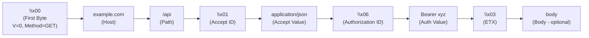
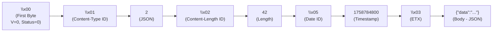
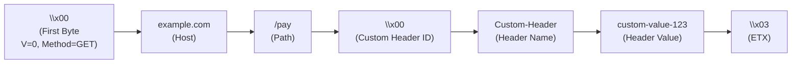

# QH - Header Tables

QH uses 1-byte header IDs instead of full header names, with separate lookup tables for requests and responses.

## Wire Format

```
<header_id>\0<value>\0...
```

## Header ID Allocation

- `0` = Custom header (escape code)
- `1-127` = Request headers (127 slots)
- `1-127` = Response headers (127 slots)

## Request Headers (IDs 1-127)

| ID     | Header Name       | Description                         | Example                    |
| ------ | ----------------- | ----------------------------------- | -------------------------- |
| 1      | Accept            | Media types client can process      | `3,2,1` (HTML, JSON, text) |
| 2      | Accept-Encoding   | Content encoding client supports    | `gzip, br, zstd`           |
| 3      | (reserved)        | Reserved (conflicts with ETX \x03)  |                            |
| 4      | Accept-Language   | Language preferences                | `en-US,en;q=0.9`           |
| 5      | Content-Type      | Numeric content type code           | `2` (for JSON)             |
| 6      | Content-Length    | Request body size in bytes          | `42`                       |
| 7      | Authorization     | Authentication credentials          | `Bearer <token>`           |
| 8      | Cookie            | HTTP cookies                        | `session=abc123`           |
| 9      | User-Agent        | Client identification               | `QH-Client/1.0`            |
| 10     | Referer           | Referring page URL                  | `qh://example.com/page`    |
| 11     | Origin            | Request origin for CORS             | `qh://example.com`         |
| 12     | If-None-Match     | Conditional request ETag            | `"abc123"`                 |
| 13     | If-Modified-Since | Conditional request timestamp       | `1758784800`               |
| 14     | Range             | Request partial content             | `bytes=0-1023`             |
| 15     | X-Payment         | x402 payment protocol payload       | `<base64-encoded-json>`    |
| 16-127 | (reserved)        | Reserved for future request headers |                            |

## Response Headers (IDs 1-127)

| ID     | Header Name                  | Description                        | Example                 |
| ------ | ---------------------------- | ---------------------------------- | ----------------------- |
| 1      | Content-Type                 | Numeric content type code          | `1` (text/plain)        |
| 2      | Content-Length               | Response body size in bytes        | `42`                    |
| 3      | (reserved)                   | Reserved (conflicts with ETX \x03) |                         |
| 4      | Cache-Control                | Caching directives                 | `max-age=3600`          |
| 5      | Content-Encoding             | Content encoding used              | `gzip`                  |
| 6      | Date                         | Unix timestamp                     | `1758784800`            |
| 7      | ETag                         | Entity tag for validation          | `"abc123"`              |
| 8      | Expires                      | Response expiration time           | `1758788400`            |
| 9      | Last-Modified                | Resource modification time         | `1758780000`            |
| 10     | Access-Control-Allow-Origin  | CORS allowed origins               | `*`                     |
| 11     | Access-Control-Allow-Methods | CORS allowed methods               | `GET, POST, PUT`        |
| 12     | Access-Control-Allow-Headers | CORS allowed headers               | `Content-Type`          |
| 13     | Set-Cookie                   | Set HTTP cookie                    | `session=abc; Secure`   |
| 14     | Location                     | Redirect location                  | `/new-path`             |
| 15     | Content-Security-Policy      | CSP directives                     | `default-src 'self'`    |
| 16     | X-Content-Type-Options       | MIME sniffing protection           | `nosniff`               |
| 17     | X-Frame-Options              | Clickjacking protection            | `SAMEORIGIN`            |
| 18     | Vary                         | Response variance                  | `Accept-Encoding`       |
| 19     | X-Payment-Response           | x402 settlement response           | `<base64-encoded-json>` |
| 20-127 | (reserved)                   | Reserved for future headers        |                         |

## Content Type Codes

Content-Type and Accept headers use numeric codes instead of MIME type strings:

| Code | MIME Type                | Description                       | Common Use Cases         |
| ---- | ------------------------ | --------------------------------- | ------------------------ |
| 0    | custom                   | Custom/unspecified type           | Rare, use specific types |
| 1    | text/plain               | Plain text                        | Simple text responses    |
| 2    | application/json         | JSON data                         | API responses, AJAX      |
| 3    | text/html                | HTML markup                       | Web pages, SPA shells    |
| 4    | application/octet-stream | Binary data                       | Files, images, downloads |
| 5-15 | (reserved)               | Reserved for future content types |                          |

**Wire format:**

```
Content-Type: 2\0      → application/json
Accept: 3,2,1\0        → text/html, application/json, text/plain (in order)
```

## Custom Headers

When a header is not in the predefined table, ID 0 will be used:

**Wire Format:**

```
\0<custom-header-name>\0<custom-value-123>\0
```

## Examples

### Request with Predefined Headers



**Complete byte sequence:**

```
\x00example.com\0/api\0\x01\0application/json\0\x06\0Bearer xyz\0\x03body
```

_Note: Body is optional for GET requests._

### Response with Predefined Headers



**Complete byte sequence:**

```
\x00\x01\02\0\x02\042\0\x05\01758784800\0\x03{"data":"..."}
```

### Request with Custom Header



**Complete byte sequence:**

```
\x00example.com\0/pay\0\x00\0-Custom-Header\0custom-value-123\0\x03
```

## Payment Protocol Support (x402)

QH supports the [x402 payment protocol](https://github.com/coinbase/x402), an open standard for web payments that enables blockchain micropayments with fast settlement and no fees.

**Required Protocol Features:**

- `X-Payment` header (Request Header ID 15)
- `X-Payment-Response` header (Response Header ID 19)
- `402 Payment Required` status code (compact code 38)
- JSON content type (code 2) for payment payloads

**Basic Flow:**

1. Client requests resource → Server responds with `402` and payment requirements (JSON)
2. Client submits payment via `X-Payment` header → Server verifies and settles
3. Server returns resource with `X-Payment-Response` header containing settlement proof

For more information, see the [x402 repository](https://github.com/coinbase/x402) and [ecosystem](https://x402.org/ecosystem)
