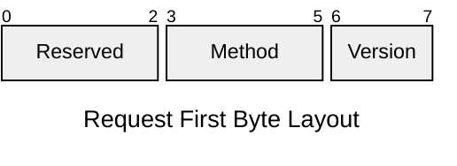
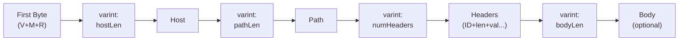
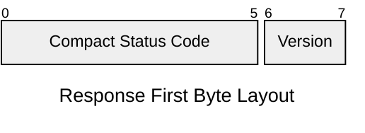
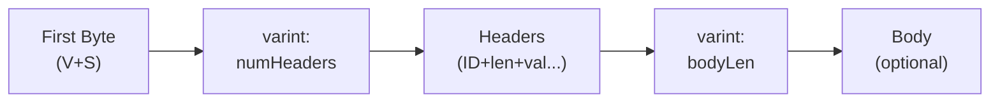

# QH Protocol

**Request for Comments: QH/0**
Category: Experimental
Status: Draft

## Table of Contents

- [QH Protocol](#qh-protocol)
  - [Table of Contents](#table-of-contents)
  - [1. Introduction](#1-introduction)
    - [1.1 Purpose](#11-purpose)
    - [1.2 Terminology](#12-terminology)
    - [1.3 Protocol Stack](#13-protocol-stack)
  - [2. Protocol Parameters](#2-protocol-parameters)
    - [2.1 QH Version](#21-qh-version)
    - [2.2 Media Types](#22-media-types)
    - [2.3 Content Encoding](#23-content-encoding)
    - [2.4 qh URI Scheme](#24-qh-uri-scheme)
  - [3. Message Format](#3-message-format)
    - [3.1 Varint Encoding](#31-varint-encoding)
    - [3.2 Protocol Limits](#32-protocol-limits)
    - [3.3 Message Structure](#33-message-structure)
  - [4. Request](#4-request)
    - [4.1 Methods](#41-methods)
    - [4.2 Request Format](#42-request-format)
    - [4.3 Request Examples](#43-request-examples)
      - [Example 1: Simple GET Request](#example-1-simple-get-request)
      - [Example 2: POST Request with Body](#example-2-post-request-with-body)
      - [Request Wire Format Legend](#request-wire-format-legend)
  - [5. Response](#5-response)
    - [5.1 Status Codes](#51-status-codes)
      - [Status Code Encoding](#status-code-encoding)
      - [5.1.1 Supported Status Codes](#511-supported-status-codes)
      - [5.1.2 Redirection](#512-redirection)
    - [5.2 Response Format](#52-response-format)
    - [5.3 Response Examples](#53-response-examples)
      - [Example 1: Simple 200 OK Response](#example-1-simple-200-ok-response)
      - [Example 2: 404 Not Found Response](#example-2-404-not-found-response)
      - [Example 3: JSON Response with Headers](#example-3-json-response-with-headers)
      - [Response Wire Format Legend](#response-wire-format-legend)
  - [6. Headers](#6-headers)
    - [6.1 Header Format](#61-header-format)
    - [6.2 Header Compression](#62-header-compression)
  - [7. Transport](#7-transport)
    - [7.1 Connection Establishment](#71-connection-establishment)
      - [7.1.1 Certificate Exchange](#711-certificate-exchange)
    - [7.2 Connection Management](#72-connection-management)
      - [7.2.1 Connection Reuse](#721-connection-reuse)
      - [7.2.2 Reusing Connections for Multiple Origins](#722-reusing-connections-for-multiple-origins)
  - [8. Security Considerations](#8-security-considerations)
  - [9. Domain Name System](#9-domain-name-system)
    - [DNS Record Format](#dns-record-format)
      - [TXT Record Structure](#txt-record-structure)
      - [Underscore Prefix](#underscore-prefix)
      - [Example Record](#example-record)
      - [Fallback Behavior](#fallback-behavior)
  - [10. Versioning](#10-versioning)

## 1. Introduction

The QH Protocol (Quite Ok HTTP Protocol) is a client-server, binary communication protocol inspired by HTTP. It defines a simple, extensible mechanism for exchanging structured requests and responses over qotp.

QH is designed to be compact and machine-efficient.

QH uses a **request/response model**.

- The client sends a request message to the server.
- The server replies with a response message.
- Messages use binary encoding for metadata (version, method, status codes) and UTF-8 for text content.
- All fields use varint length prefixes for efficient, binary-safe framing.

### 1.1 Purpose

The QH Protocol is an application-level protocol for distributed information systems, inspired by HTTP/1.1. Its primary goal is to provide a much simpler and more compact alternative to HTTP for client-server communication, while retaining the core request/response paradigm.

QH was designed to reduce the verbosity and complexity found in HTTP. It achieves this through a simplified message format. This makes it suitable for environments where bandwidth is limited or parsing overhead needs to be minimized.

While HTTP is a feature-rich protocol for hypermedia systems, QH focuses on providing a fundamental, extensible mechanism for resource exchange over a secure transport.

### 1.2 Terminology

- **Client**: The initiating party that sends a request.
- **Server**: The receiving party that processes a request and sends back a response.
- **Message**: Either a request or a response, consisting of a start line, headers, and an optional body.
- **Header**: A key-value pair providing metadata about a message.

### 1.3 Protocol Stack

```
┌─────────────────────────────────────────────────────────────┐
│            Application Layer: qh:// Protocol                │
│  • HTTP-inspired request/response semantics                 │
│  • Compact binary encoding                                  │
│  • DNS TXT record key distribution                          │
├─────────────────────────────────────────────────────────────┤
│            Transport Layer: QOTP                            │
│  • 0-RTT connection establishment                           │
│  • Built-in encryption (curve25519/chacha20-poly1305)       │
│  • UDP-based communication                                  │
│  • Stream multiplexing                                      │
├─────────────────────────────────────────────────────────────┤
│               Network Layer: UDP/IP                         │
│  • Standard network layer                                   │
└─────────────────────────────────────────────────────────────┘
```

## 2. Protocol Parameters

### 2.1 QH Version

QH uses a `<number>` numbering scheme to indicate the protocol version. This policy allows communicating parties to know the message format and capabilities of each other.

The protocol version is included in the start-line of every request and response. This document specifies version `0`.

A server that receives a request with a major version higher than what it supports SHOULD respond with a `505 (Version Not Supported)` error.

### 2.2 Media Types

QH uses a compact numeric encoding for content types instead of traditional MIME type strings. This reduces bandwidth while supporting the most common types needed for Single Page Applications.

Content types are encoded as single-digit numeric codes (0-15, using 4 bits) in the wire format. The following content types are defined:

| Code | MIME Type Equivalent     | Description                 |
| ---- | ------------------------ | --------------------------- |
| 0    | custom                   | Custom/application-specific |
| 1    | text/plain               | Plain text                  |
| 2    | application/json         | JSON data                   |
| 3    | text/html                | HTML documents              |
| 4    | application/octet-stream | Binary data                 |
| 5-15 | (reserved)               | Reserved for future use     |

**Note:** Code 0 (custom) allows applications to define their own content type.

The numeric code is transmitted as an ASCII digit string in the Content-Type header field (e.g., `"2"` for JSON).

**Content-Type Header Behavior:**

- Following HTTP conventions, Content-Type is **recommended but not mandatory** for POST requests
- If missing, the server defaults to code 4 (application/octet-stream)
- If present, the value must be a valid code (0-15), otherwise the server returns 415 Unsupported Media Type

### 2.3 Content Encoding

QH supports content encoding negotiation via the `Accept-Encoding` request header. This allows clients to indicate which compression algorithms they support for response bodies.

**Supported encoding values:**

- `gzip` - GNU zip compression
- `br` - Brotli compression
- `zstd` - Zstandard compression

Multiple encodings can be specified as a comma-separated list (e.g., `gzip,br,zstd`). The client's preference order is respected: the server uses the first encoding from the client's list that the server also supports.

**Compression Behavior:**

- **Header present with values** (e.g., `Accept-Encoding: zstd, br, gzip`): Server compresses response if beneficial
- **Header missing or empty** (e.g., `Accept-Encoding: ""`): Server sends uncompressed response
- **No match**: If client and server have no common encodings, response is uncompressed

The server only applies compression when:

- Response body is ≥1KB (smaller responses have negligible benefit)
- Content is compressible (skips binary content like `application/octet-stream`)
- Compression actually reduces size (if compressed size ≥ original, uncompressed is sent)

**Simplified Design:**

Unlike HTTP/1.1 (RFC 7231), QH does not support:

- Quality values (e.g., `gzip;q=0.8`) - client preference order is used instead
- Wildcard encodings (`*`) - clients must explicitly list supported encodings
- `identity` encoding - use empty string or omit header to disable compression

### 2.4 qh URI Scheme

The "qh" URI scheme is defined for identifying resources that are accessible via the QH protocol. Communication is performed over `qotp`, a secure, UDP-based transport.

```text
qh-URI = "qh" "://" authority path-abempty [ "?" query ]
```

The origin server for a "qh" URI is identified by the `authority` component, which includes a host identifier and an optional port number. If the port is not specified, the default port for QH is `8090`.

A sender MUST NOT generate a "qh" URI with an empty host identifier. A recipient that processes such a URI MUST reject it as invalid.

The hierarchical `path` component and optional `query` component identify the target resource within the origin server's namespace.

All communication over QH is inherently secured by the underlying `qotp` transport, which provides mandatory end-to-end encryption. Clients and servers do not need to perform additional steps to secure the channel, as this is a built-in feature of the transport layer.

Resources made available via the "qh" scheme have no shared identity with resources from "http" or "https" schemes. They are distinct origins with separate namespaces.

## 3. Message Format

QH uses a length-prefixed binary format with varint encoding for efficiency and binary safety.

### 3.1 Varint Encoding

QH uses unsigned LEB128 (Little Endian Base 128) varint encoding for all length fields. This is the same encoding used by Protocol Buffers and other binary protocols.

**Encoding rules:**

- Each byte uses 7 bits for data and 1 bit (MSB) as a continuation flag
- MSB = 1: more bytes follow
- MSB = 0: last byte
- Values are encoded little-endian

**Examples:**

```
Value 0:       0x00                    (1 byte)
Value 127:     0x7F                    (1 byte)
Value 128:     0x80 0x01               (2 bytes)
Value 300:     0xAC 0x02               (2 bytes)
Value 16,384:  0x80 0x80 0x01          (3 bytes)
```

**Size efficiency:**

- 0-127: 1 byte
- 128-16,383: 2 bytes
- 16,384-2,097,151: 3 bytes
- Maximum: 10 bytes for uint64

### 3.2 Protocol Limits

QH does not mandate specific limits. Implementations SHOULD enforce reasonable limits based on their deployment environment to prevent resource exhaustion attacks.

**Recommended guidelines:**

- For broad interoperability, implementations SHOULD support paths up to 8 KB and header sections up to 16 KB
- Body size limits are application-specific

Implementations that reject messages due to size constraints SHOULD return:

- `414 URI Too Long` - path exceeds limit
- `431 Request Header Fields Too Large` - headers exceed limit
- `413 Payload Too Large` - body exceeds limit

### 3.3 Message Structure

**Key principles:**

- **First byte**: Encodes version + method/status (see sections 4.1 and 5.1)
- **Varint length prefixes**: All variable-length fields use varint-encoded lengths
- **Binary-safe**: No reserved separator bytes (all data is binary-safe)
- **Body**: Optional content (JSON, HTML, binary data, etc.)

**Message completeness:**

- Read varints to determine exact field boundaries
- Message length is deterministic from length prefixes

## 4. Request

### 4.1 Methods

QH Version 0 defines the following methods, encoded in the first byte:



| Method | Code | First Byte | Description                     |
| ------ | ---- | ---------- | ------------------------------- |
| GET    | 000  | `\x00`     | Retrieve a resource             |
| POST   | 001  | `\x08`     | Create a new resource           |
| PUT    | 010  | `\x10`     | Replace a resource entirely     |
| PATCH  | 011  | `\x18`     | Partially modify a resource     |
| DELETE | 100  | `\x20`     | Remove a resource               |
| HEAD   | 101  | `\x28`     | Retrieve headers only (no body) |

**Encoding:** Version is `0` for QH/0. Method bits are encoded in positions 3-5 (middle 3 bits). Reserved bits (0-2) must be 0.

**Bit Layout Example:**

```
[VV][MMM][RRR]

Byte value \x00 (GET):    00 000 000 = Version 0, Method 0 (GET), Reserved 0
Byte value \x08 (POST):   00 001 000 = Version 0, Method 1 (POST), Reserved 0
Byte value \x10 (PUT):    00 010 000 = Version 0, Method 2 (PUT), Reserved 0
Byte value \x18 (PATCH):  00 011 000 = Version 0, Method 3 (PATCH), Reserved 0
Byte value \x20 (DELETE): 00 100 000 = Version 0, Method 4 (DELETE), Reserved 0
Byte value \x28 (HEAD):   00 101 000 = Version 0, Method 5 (HEAD), Reserved 0
```

**Available Capacity:** The 3-bit method field supports up to 8 methods (values 0-7). QH Version 0 defines 6 methods.

### 4.2 Request Format

```
<1-byte-method><varint:hostLen><host><varint:pathLen><path><varint:numHeaders>[headers]<varint:bodyLen><body>
```

**Fields:**

- **First byte**: Version + Method encoding (see [4.1](#41-methods))
- **Host length** (varint): Length of host field in bytes
- **Host**: Target hostname (required, non-empty)
- **Path length** (varint): Length of path field in bytes
- **Path**: Resource path (defaults to `/` if empty)
- **Number of headers** (varint): Count of header key-value pairs
- **Headers**: Sequence of header entries (see [6. Headers](#6-headers) for format details)
- **Body length** (varint): Length of body in bytes (0 if no body)
- **Body**: Optional request body

### 4.3 Request Examples

#### Example 1: Simple GET Request

```
GET /hello
Host: example.com
```

**Wire format structure (minimal request without headers):**

```
┌──────┐  ┌──────┐  ┌─────────────┐  ┌──────┐  ┌────────┐  ┌──────┐  ┌──────┐
│ 0x00 │──│ 0x0B │──│ example.com │──│ 0x06 │──│ /hello │──│ 0x00 │──│ 0x00 │
└──────┘  └──────┘  └─────────────┘  └──────┘  └────────┘  └──────┘  └──────┘
   │         │             │             │           │          │         │
   │         │             │             │           │          │         └─ Body length: 0
   │         │             │             │           │          └─────────── Num headers: 0
   │         │             │             │           └────────────────────── Path: "/hello"
   │         │             │             └────────────────────────────────── Path length: 6
   │         │             └──────────────────────────────────────────────── Host: "example.com"
   │         └────────────────────────────────────────────────────────────── Host length: 11
   └──────────────────────────────────────────────────────────────────────── First byte (V=0, Method=GET)
```

**Complete byte sequence:**

```
\x00 \x0B example.com \x06 /hello \x00 \x00
```

**Breakdown:**

- `\x00`: First byte (Version=0, Method=GET, Reserved=0)
- `\x0B`: Host length (11 bytes, varint)
- `example.com`: Host value (11 bytes)
- `\x06`: Path length (6 bytes, varint)
- `/hello`: Path value (6 bytes)
- `\x00`: Number of headers (0, varint)
- `\x00`: Body length (0 bytes, varint)

#### Example 2: POST Request with Body

```
POST /echo
Host: example.com
Accept: 2,1 (JSON, text/plain)
Content-Type: 1 (text/plain)
Body: "Hello QH World!"
```

**Wire format structure:**

```
┌─────────────────────────────────────────┐
│ 0x08                                    │  First byte (V=0, Method=POST)
├─────────────────────────────────────────┤
│ 0x0B                                    │  Host length: 11
├─────────────────────────────────────────┤
│ example.com                             │  Host
├─────────────────────────────────────────┤
│ 0x05                                    │  Path length: 5
├─────────────────────────────────────────┤
│ /echo                                   │  Path
├─────────────────────────────────────────┤
│ 0x02                                    │  Number of headers: 2
├─────────────────────────────────────────┤
│ 0x01                                    │  Header 1: Accept ID
├─────────────────────────────────────────┤
│ 0x03                                    │  Accept value length: 3
├─────────────────────────────────────────┤
│ 2,1                                     │  Accept value
├─────────────────────────────────────────┤
│ 0x04                                    │  Header 2: Content-Type ID
├─────────────────────────────────────────┤
│ 0x01                                    │  Content-Type value length: 1
├─────────────────────────────────────────┤
│ 1                                       │  Content-Type value
├─────────────────────────────────────────┤
│ 0x0F                                    │  Body length: 15
├─────────────────────────────────────────┤
│ Hello QH World!                         │  Body
└─────────────────────────────────────────┘
```

**Complete byte sequence:**

```
\x08 \x0B example.com \x05 /echo \x02 \x01 \x03 2,1 \x04 \x01 1 \x0F Hello QH World!
```

**Breakdown:**

- `\x08`: First byte (Version=0, Method=POST)
- `\x0B`: Host length (11 bytes)
- `example.com`: Host value
- `\x05`: Path length (5 bytes)
- `/echo`: Path value
- `\x02`: Number of headers (2)
- **Header 1 (Accept):**
  - `\x01`: Header ID (Accept)
  - `\x03`: Value length (3 bytes, varint)
  - `2,1`: Value (JSON, text/plain codes)
- **Header 2 (Content-Type):**
  - `\x04`: Header ID (Content-Type)
  - `\x01`: Value length (1 byte, varint)
  - `1`: Value (text/plain code)
- `\x0F`: Body length (15 bytes)
- `Hello QH World!`: Body content

#### Request Wire Format Legend



## 5. Response

### 5.1 Status Codes

QH/0 uses HTTP-compatible status codes but encodes them in a compact wire format for efficiency. Status codes are mapped to single-byte compact codes ordered by frequency of use.

The protocol supports standard HTTP status code categories:

- `1xx` Informational — Request received, continuing process
- `2xx` Success — Request successfully processed (e.g., `200 OK`)
- `3xx` Redirection — Further action is needed (e.g., `301 Moved`)
- `4xx` Client Error — The client sent a bad request (e.g., `404 Not Found`)
- `5xx` Server Error — The server failed to process a valid request (e.g., `500 Internal Error`)

#### Status Code Encoding

Response version and status code are packed into a single byte:



The 6-bit status code field supports 64 status codes (0-63), ordered by frequency.

#### 5.1.1 Supported Status Codes

The following status codes are supported with their compact wire format encoding:

| HTTP Code | Compact Code | Reason Phrase                 |
| --------- | ------------ | ----------------------------- |
| 200       | 0            | OK                            |
| 404       | 1            | Not Found                     |
| 500       | 2            | Internal Server Error         |
| 302       | 3            | Found                         |
| 400       | 4            | Bad Request                   |
| 403       | 5            | Forbidden                     |
| 401       | 6            | Unauthorized                  |
| 301       | 7            | Moved Permanently             |
| 304       | 8            | Not Modified                  |
| 503       | 9            | Service Unavailable           |
| 201       | 10           | Created                       |
| 202       | 11           | Accepted                      |
| 204       | 12           | No Content                    |
| 206       | 13           | Partial Content               |
| 307       | 14           | Temporary Redirect            |
| 308       | 15           | Permanent Redirect            |
| 409       | 16           | Conflict                      |
| 410       | 17           | Gone                          |
| 412       | 18           | Precondition Failed           |
| 413       | 19           | Payload Too Large             |
| 414       | 20           | URI Too Long                  |
| 415       | 21           | Unsupported Media Type        |
| 422       | 22           | Unprocessable Entity          |
| 429       | 23           | Too Many Requests             |
| 502       | 24           | Bad Gateway                   |
| 504       | 25           | Gateway Timeout               |
| 505       | 26           | QH Version Not Supported      |
| 100       | 27           | Continue                      |
| 101       | 28           | Switching Protocols           |
| 102       | 29           | Processing                    |
| 103       | 30           | Early Hints                   |
| 205       | 31           | Reset Content                 |
| 207       | 32           | Multi-Status                  |
| 208       | 33           | Already Reported              |
| 226       | 34           | IM Used                       |
| 300       | 35           | Multiple Choices              |
| 303       | 36           | See Other                     |
| 305       | 37           | Use Proxy                     |
| 402       | 38           | Payment Required              |
| 405       | 39           | Method Not Allowed            |
| 406       | 40           | Not Acceptable                |
| 407       | 41           | Proxy Authentication Required |
| 408       | 42           | Request Timeout               |
| 411       | 43           | Length Required               |
| 416       | 44           | Range Not Satisfiable         |
| 417       | 45           | Expectation Failed            |

**Encoding Rules:**

- Status codes are ordered by frequency to optimize common cases
- Unmapped status codes default to 500 (Internal Server Error) with compact code 2.
- The compact code and version are packed into the first byte of the response.

#### 5.1.2 Redirection

When a client receives a `3xx` status code (e.g., 300, 301, 302), it indicates that the requested resource has moved. The client should look for headers in the response to determine the new location. QH supports two mechanisms for specifying the new location, which clients should process in the following order of priority:

1.  **Custom `host` and `path` Headers:**
    The server can provide the new location using two separate headers: `host` for the new hostname and `path` for the new resource path. This is the preferred mechanism for QH-specific redirects.
    - `host`: The hostname of the new origin.
    - `path`: The path to the resource on the new host.

    Example:
    `host: qh2.example.com`
    `path: /new-resource`

2.  **Standard `Location` Header:**
    As a fallback, QH supports the standard `Location` header, which should contain a full `qh://` URI pointing to the new resource.

    Example:
    `Location: qh://qh2.example.com/new-resource`

Upon receiving a redirect, a client MUST make a new `GET` request to the new location. To prevent infinite redirect loops, clients SHOULD limit the number of consecutive redirects (e.g., to a maximum of 10). If the hostname changes, the client is responsible for closing the current connection and establishing a new one to the new host.

### 5.2 Response Format

```
<1-byte-status><varint:numHeaders>[headers]<varint:bodyLen><body>
```

**Fields:**

- **First byte**: Version + Status encoding (see [5.1](#51-status-codes))
- **Number of headers** (varint): Count of header key-value pairs
- **Headers**: Sequence of header entries (see [6. Headers](#6-headers) for format details)
- **Body length** (varint): Length of body in bytes (0 if no body)
- **Body**: Optional response content

### 5.3 Response Examples

#### Example 1: Simple 200 OK Response

```
Status: 200 OK
Content-Type: 1 (text/plain)
Body: "Hello from QH Protocol!"
```

**Wire format structure:**

```
┌──────┐  ┌──────┐  ┌──────┐  ┌──────┐  ┌───┐  ┌──────┐  ┌──────────────────────────┐
│ 0x00 │──│ 0x01 │──│ 0x01 │──│ 0x01 │──│ 1 │──│ 0x17 │──│ Hello from QH Protocol!  │
└──────┘  └──────┘  └──────┘  └──────┘  └───┘  └──────┘  └──────────────────────────┘
   │         │         │         │        │        │                   │
   │         │         │         │        │        │                   └─── Body (23 bytes)
   │         │         │         │        │        └─────────────────────── Body length: 23
   │         │         │         │        └──────────────────────────────── Content-Type value: "1"
   │         │         │         └───────────────────────────────────────── Content-Type value len: 1
   │         │         └─────────────────────────────────────────────────── Content-Type ID (0x01)
   │         └───────────────────────────────────────────────────────────── Number of headers: 1
   └─────────────────────────────────────────────────────────────────────── First byte (V=0, Status=0 → HTTP 200)
```

**Complete byte sequence:**

```
\x00 \x01 \x01 \x01 1 \x17 Hello from QH Protocol!
```

**Breakdown:**

- `\x00`: First byte (Version=0, Compact Status=0 → HTTP 200)
- `\x01`: Number of headers (1)
- **Header 1:**
  - `\x01`: Header ID (Content-Type)
  - `\x01`: Value length (1 byte)
  - `1`: Value (text/plain code)
- `\x17`: Body length (23 bytes)
- `Hello from QH Protocol!`: Body content

#### Example 2: 404 Not Found Response

```
Status: 404 Not Found
Content-Type: text/plain (code 1)
Body: "Not Found"
```

**Wire format structure:**

```
┌──────┐  ┌──────┐  ┌──────┐  ┌──────┐  ┌───┐  ┌──────┐  ┌───────────┐
│ 0x01 │──│ 0x01 │──│ 0x04 │──│ 0x01 │──│ 1 │──│ 0x09 │──│ Not Found │
└──────┘  └──────┘  └──────┘  └──────┘  └───┘  └──────┘  └───────────┘
   │         │         │         │        │        │            │
   │         │         │         │        │        │            └─ Body (9 bytes)
   │         │         │         │        │        └──────────────── Body length: 9
   │         │         │         │        └───────────────────────── Content-Type value: "1"
   │         │         │         └────────────────────────────────── Content-Type value len: 1
   │         │         └──────────────────────────────────────────── Content-Type ID (0x04)
   │         └────────────────────────────────────────────────────── Number of headers: 1
   └──────────────────────────────────────────────────────────────── First byte (V=0, Status=1 → HTTP 404)
```

**Complete byte sequence:**

```
\x01 \x01 \x04 \x01 1 \x09 Not Found
```

**Breakdown:**

- `\x01`: First byte (Version=0, Compact Status=1 → HTTP 404)
- `\x01`: Number of headers (1)
- **Header 1 (Content-Type):**
  - `\x04`: Header ID (Content-Type)
  - `\x01`: Value length (1 byte, varint)
  - `1`: Value (text/plain code)
- `\x09`: Body length (9 bytes)
- `Not Found`: Body content

#### Example 3: JSON Response with Headers

```
Status: 200 OK
Content-Type: application/json (code 2)
Cache-Control: max-age=3600
Date: 1758784800
Body: {"name":"John Doe","id":123,"active":true}
```

**Wire format structure:**

```
┌─────────────────────────────────────────┐
│ 0x00                                    │  First byte (V=0, Status=0 → HTTP 200)
├─────────────────────────────────────────┤
│ 0x03                                    │  Number of headers: 3
├─────────────────────────────────────────┤
│ 0x04                                    │  Header 1: Content-Type ID
├─────────────────────────────────────────┤
│ 0x01                                    │  Content-Type value length: 1
├─────────────────────────────────────────┤
│ 2                                       │  Content-Type value (JSON code)
├─────────────────────────────────────────┤
│ 0x05                                    │  Header 2: Cache-Control ID
├─────────────────────────────────────────┤
│ 0x0C                                    │  Cache-Control value length: 12
├─────────────────────────────────────────┤
│ max-age=3600                            │  Cache-Control value
├─────────────────────────────────────────┤
│ 0x06                                    │  Header 3: Date ID
├─────────────────────────────────────────┤
│ 0x0A                                    │  Date value length: 10
├─────────────────────────────────────────┤
│ 1758784800                              │  Date value (Unix timestamp)
├─────────────────────────────────────────┤
│ 0x2A                                    │  Body length: 42
├─────────────────────────────────────────┤
│ {"name":"John Doe","id":123,...}        │  Body
└─────────────────────────────────────────┘
```

**Complete byte sequence:**

```
\x00 \x03 \x04 \x01 2 \x05 \x0C max-age=3600 \x06 \x0A 1758784800 \x2A {"name":"John Doe","id":123,"active":true}
```

**Breakdown:**

- `\x00`: First byte (Version=0, Compact Status=0 → HTTP 200)
- `\x03`: Number of headers (3)
- **Header 1 (Content-Type):**
  - `\x04`: Header ID (Content-Type)
  - `\x01`: Value length (1 byte, varint)
  - `2`: Value (JSON code)
- **Header 2 (Cache-Control):**
  - `\x05`: Header ID (Cache-Control)
  - `\x0C`: Value length (12 bytes, varint)
  - `max-age=3600`: Value
- **Header 3 (Date):**
  - `\x06`: Header ID (Date)
  - `\x0A`: Value length (10 bytes, varint)
  - `1758784800`: Value (Unix timestamp)
- `\x2A`: Body length (42 bytes)
- `{"name":"John Doe","id":123,"active":true}`: Body content

#### Response Wire Format Legend



## 6. Headers

For the available headers, see [headers](./headers.md).

### 6.1 Header Format

Headers use a compact encoding with varint length prefixes for efficient, binary-safe transmission.

QH uses a **static header table** that maps single-byte IDs to either complete header key-value pairs (most frequent combinations) or header names only (common headers with variable values). This eliminates the need for dynamic compression schemes like HPACK/QPACK.

**Header ID Space Allocation:**

```
0x00     = Custom header (key and value both transmitted)
0x01 - X = Complete key-value pairs (X most common combinations)
X - X    = Header names only (X header names, value transmitted separately)
X - X    = Reserved (future use)
```

**Three header formats:**

1. **Complete key-value pair:** Single byte, no additional data needed
2. **Header name with value:** ID + value length + value
3. **Custom header:** Full key and value with length prefixes

**Format 1: Complete key-value pair:**

```
<byte:headerID>
```

For the most common header combinations:

1. **Header ID** (1 byte): Complete key-value pair (see [headers](./headers.md))

**Format 2: Header name with value:**

```
<byte:headerID><varint:valueLen><value>
```

For standard headers with custom values:

1. **Header ID** (1 byte): Header name (see [headers](./headers.md))
2. **Value length** (varint): Length of the header value in bytes
3. **Value**: The header value

**Format 3: Custom header (0x00):**

```
<byte:0x00><varint:keyLen><key><varint:valueLen><value>
```

For custom headers not in the standard header table:

1. **Header ID** (1 byte): `0x00` indicates a custom header
2. **Key length** (varint): Length of the header key name in bytes
3. **Key**: The header key name (UTF-8)
4. **Value length** (varint): Length of the header value in bytes
5. **Value**: The header value

**Example 1 - Complete key-value pair:**

TODO: update with the actual key-value pair from table

```
Header: Content-Type: application/json

Wire format:
\x01

Breakdown:
- \x01: Complete header (Content-Type: application/json)
```

**Example 2 - Header name with value:**

```
Header: Date: 1758784800

Wire format:
\x26 \x0A 1758784800

Breakdown:
- \x26: Header ID (Date name)
- \x0A: Value length (10 bytes, varint)
- 1758784800: Value (Unix timestamp)
```

**Example 3 - Custom Header:**

```
Header: X-Request-ID: abc123

Wire format:
\x00 \x0C X-Request-ID \x06 abc123

Breakdown:
- \x00: Custom header indicator
- \x0C: Key length (12 bytes, varint)
- X-Request-ID: Key name
- \x06: Value length (6 bytes, varint)
- abc123: Value
```

**Efficiency Comparison:**

TODO: for `complete pair` update with the actual wire format ID, once static header table is done

| Format        | Example                          | Wire Format                          | Wire Size | Use Case                            |
| ------------- | -------------------------------- | ------------------------------------ | --------- | ----------------------------------- |
| Complete pair | `Content-Type: application/json` | `\x01`                               | 1 byte    | Most common combinations            |
| Name + value  | `Date: 1758784800`               | `\x26 \x0A 1758784800`               | 12 bytes  | Common headers with variable values |
| Custom        | `X-Request-ID: abc123`           | `\x00 \x0C X-Request-ID \x06 abc123` | 21 bytes  | Application-specific headers        |

**Usage Notes:**

- GET requests: typically omit `Content-Type`
- POST requests: `Content-Type` recommended but optional (defaults to code 4 - octet-stream)
- Accept uses numeric codes: `text/html,application/json,text/plain` → `3,2,1`
- The static table (see [headers](./headers.md)) defines which IDs map to complete pairs vs header names

#### 6.1.1 Header Name Normalization

Header field names in QH/0 are case-insensitive per HTTP semantics (RFC 7230).

However, for encoding efficiency and consistency with HTTP/2 (RFC 7540), header
names MUST be converted to lowercase before transmission and table lookup.

Implementations:

- MUST normalize all header names to lowercase before encoding
- MUST normalize all header names to lowercase after decoding
- MAY accept mixed-case headers from legacy clients but MUST normalize them

### 6.2 Header Compression

Unlike HTTP/2 (HPACK) and HTTP/3 (QPACK), QH does not implement header compression schemes. This design decision is intentional.

The main reason QH doesn't use header compression is that the protocol is compact by design through multiple optimizations:

- **Static header table**: Uses a built-in static header table for the most common key-value pair mappings and header names
- **Numeric methods**: HTTP methods encoded as single bytes (`\x00` = GET, `\x08` = POST, etc.)
- **Compact content types**: Single-byte encoding (`2` = application/json)
- **Status codes**: 6-bit status code encoding
- **Varint lengths**: Variable-length integer encoding for header/body sizes

This binary-first approach trades maximum compression efficiency for simplicity, eliminating the overhead and complexity of dynamic compression tables (like HPACK/QPACK).

## 7. Transport

QH is designed to be transported over **qotp**, a secure, reliable, stream-multiplexed protocol running on top of UDP.

`qotp` provides an encrypted transport layer, similar in concept to QUIC, handling reliability and congestion control internally.

A single `qotp` connection can carry multiple concurrent streams, allowing for parallel requests and responses without head-of-line blocking.

### 7.1 Connection Establishment

#### 7.1.1 Certificate Exchange

QOTP enables you to use it without knowing the servers public certificate. But when we don't know the server public certificate it takes some packets for the handshake. A better approach would be to connect to the server knowing the server public certificate.

To get the server certificate before connecting to the server we try to get the certificate from the DNS.

We need a DNS Entry we can get from the client before connecting.

### 7.2 Connection Management

#### 7.2.1 Connection Reuse

QH connections, which are built on the underlying `qotp` transport, are persistent. For best performance, clients SHOULD reuse connections for multiple requests rather than establishing a new connection for each one. Connections should remain open until it is determined that no further communication with the server is necessary (e.g., when a user navigates away from an application) or until the server closes the connection.

Clients SHOULD NOT open more than one QH connection to a given IP address and UDP port for the same transport configuration.

#### 7.2.2 Reusing Connections for Multiple Origins

A single connection to a server endpoint MAY be reused for requests to different origins (i.e., different hostnames) if they resolve to the same IP address. To do this securely, the client MUST validate that the server is authoritative for the new origin. This involves verifying the server's public key against the expected key for the new origin (e.g., by fetching it from a DNS TXT record).

If the server's identity cannot be verified for the new origin, the client MUST NOT reuse the connection for that origin and SHOULD establish a new connection instead.

## 8. Security Considerations

QH inherits its security properties from the underlying **qotp** transport protocol.

`qotp` provides mandatory, built-in, end-to-end encryption for all connections, ensuring both confidentiality and integrity of data in transit. This is analogous to running HTTP over TLS (HTTPS).

While the transport is secure, implementations MUST still validate input to avoid application-level vulnerabilities such as buffer overflows, header injection, and other common attacks.

Future specifications MAY define authentication headers or security extensions.

## 9. Domain Name System

Traditional HTTPS relies on Certificate Authorities (CAs) to establish trust. QH uses DNS TXT records to distribute server public keys, enabling clients to establish secure 0-RTT connections.

### DNS Record Format

#### TXT Record Structure

For a domain serving QH protocol (e.g., `example.com`), publish a TXT record containing the server's public key:

```
_qotp.example.com.  IN  TXT  "v=0;k=<base64-encoded-public-key>"
```

**Field Descriptions:**

| Field   | Description                               | Format                     | Example                  |
| ------- | ----------------------------------------- | -------------------------- | ------------------------ |
| `_qotp` | Subdomain prefix identifying QOTP records | Fixed string               | `_qotp`                  |
| `v`     | QOTP protocol version                     | Integer                    | `0`                      |
| `k`     | Server's X25519 public key                | Base64-encoded 32-byte key | `ABCDEFGHIJKLMNOPQRS...` |

**Format:** Fields are separated by semicolons (`;`), with no spaces: `v=0;k=<key>`

#### Underscore Prefix

The `_qotp` prefix follows the standard DNS naming convention for service-specific records as defined in RFC 2782 and RFC 6763. According to RFC 2782:

> "An underscore (\_) is prepended to the service identifier to avoid collisions with DNS labels that occur in nature."

- This pattern is also used by DNS-SD and DKIM

#### Example Record

```
_qotp.example.com.  IN  TXT  "v=0;k=ABCDEFGHIJKLMNOPQRSTUVWXYZabcdefghijklmnop="
```

#### Fallback Behavior

In case a DNS lookup fails or the TXT record is missing/invalid, the client can fall back to a standard QOTP in-band key exchange (adds 1-RTT).

## 10. Versioning

This document specifies QH/0.

Future versions MAY introduce new methods, headers, or binary framing.

Backward compatibility SHOULD be maintained where possible.

Clients and servers MUST include the protocol version in the request and response start lines.
