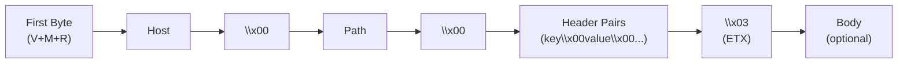
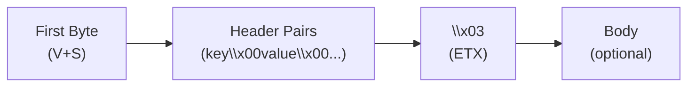

# QH Protocol

**Request for Comments: QH/0**
Category: Experimental
Status: Draft

## Table of Contents

- [QH Protocol](#qh-protocol)
  - [Table of Contents](#table-of-contents)
  - [1. Introduction](#1-introduction)
    - [1.1 Purpose](#11-purpose)
    - [1.2 Terminology](#12-terminology)
  - [2. Protocol Parameters](#2-protocol-parameters)
    - [2.1 QH Version](#21-qh-version)
    - [2.2 Media Types](#22-media-types)
    - [2.3 Content Encoding](#23-content-encoding)
    - [2.4 qh URI Scheme](#24-qh-uri-scheme)
  - [3. Message Format](#3-message-format)
  - [4. Request](#4-request)
    - [4.1 Methods](#41-methods)
    - [4.2 Request Format](#42-request-format)
    - [4.3 Request Examples](#43-request-examples)
      - [Example 1: Simple GET Request](#example-1-simple-get-request)
      - [Example 2: POST Request with Body](#example-2-post-request-with-body)
      - [Request Wire Format Legend](#request-wire-format-legend)
  - [5. Response](#5-response)
    - [5.1 Status Codes](#51-status-codes)
      - [Status Code Encoding](#status-code-encoding)
      - [5.1.1 Supported Status Codes](#511-supported-status-codes)
    - [5.2 Response Format](#52-response-format)
    - [5.3 Response Examples](#53-response-examples)
      - [Example 1: Simple 200 OK Response](#example-1-simple-200-ok-response)
      - [Example 2: 404 Not Found Response](#example-2-404-not-found-response)
      - [Example 3: JSON Response with Headers](#example-3-json-response-with-headers)
      - [Response Wire Format Legend](#response-wire-format-legend)
  - [6. Headers](#6-headers)
  - [7. Transport](#7-transport)
    - [7.1 Connection Establishment](#71-connection-establishment)
      - [7.1.1 Certificate Exchange](#711-certificate-exchange)
    - [7.2 Connection Management](#72-connection-management)
      - [7.2.1 Connection Reuse](#721-connection-reuse)
      - [7.2.2 Reusing Connections for Multiple Origins](#722-reusing-connections-for-multiple-origins)
  - [8. Security Considerations](#8-security-considerations)
  - [9. Domain Name System](#9-domain-name-system)
  - [10. Versioning](#10-versioning)

## 1. Introduction

The QH Protocol (Quite Ok HTTP Protocol) is a client-server, binary communication protocol inspired by HTTP. It defines a simple, extensible mechanism for exchanging structured requests and responses over qotp.

QH is designed to be compact and machine-efficient.

QH uses a **request/response model**.

- The client sends a request message to the server.
- The server replies with a response message.
- Messages use binary encoding for metadata (version, method, status codes) and UTF-8 for text content.
- The header section is separated from the body by the End of Text (ETX) character `\x03`.

### 1.1 Purpose

The QH Protocol is an application-level protocol for distributed information systems, inspired by HTTP/1.1. Its primary goal is to provide a much simpler and more compact alternative to HTTP for client-server communication, while retaining the core request/response paradigm.

QH was designed to reduce the verbosity and complexity found in HTTP. It achieves this through a simplified message format. This makes it suitable for environments where bandwidth is limited or parsing overhead needs to be minimized.

While HTTP is a feature-rich protocol for hypermedia systems, QH focuses on providing a fundamental, extensible mechanism for resource exchange over a secure transport.

### 1.2 Terminology

- **Client**: The initiating party that sends a request.
- **Server**: The receiving party that processes a request and sends back a response.
- **Message**: Either a request or a response, consisting of a start line, headers, and an optional body.
- **Header**: A key-value pair providing metadata about a message.

## 2. Protocol Parameters

### 2.1 QH Version

QH uses a `<number>` numbering scheme to indicate the protocol version. This policy allows communicating parties to know the message format and capabilities of each other.

The protocol version is included in the start-line of every request and response. This document specifies version `0`.

A server that receives a request with a major version higher than what it supports SHOULD respond with a `505 (Version Not Supported)` error.

### 2.2 Media Types

QH uses a compact numeric encoding for content types instead of traditional MIME type strings. This reduces bandwidth while supporting the most common types needed for Single Page Applications.

Content types are encoded as single-digit numeric codes (0-15, using 4 bits) in the wire format. The following content types are defined:

| Code | MIME Type Equivalent     | Description                 |
| ---- | ------------------------ | --------------------------- |
| 0    | custom                   | Custom/application-specific |
| 1    | text/plain               | Plain text                  |
| 2    | application/json         | JSON data                   |
| 3    | text/html                | HTML documents              |
| 4    | application/octet-stream | Binary data                 |
| 5-15 | (reserved)               | Reserved for future use     |

**Note:** Code 0 (custom) allows applications to define their own content type.

The numeric code is transmitted as an ASCII digit string in the Content-Type header field (e.g., `"2"` for JSON).

**Content-Type Header Behavior:**

- Following HTTP conventions, Content-Type is **recommended but not mandatory** for POST requests
- If missing, the server defaults to code 4 (application/octet-stream)
- If present, the value must be a valid code (0-15), otherwise the server returns 415 Unsupported Media Type

### 2.3 Content Encoding

QH supports content encoding negotiation via the `Accept-Encoding` request header. This allows clients to indicate which compression algorithms they support for response bodies.

Common encoding values include:

- `gzip` - GNU zip compression
- `br` - Brotli compression
- `zstd` - Zstandard compression
- `deflate` - DEFLATE compression

Multiple encodings can be specified as a comma-separated list (e.g., `gzip,br,zstd`).

### 2.4 qh URI Scheme

The "qh" URI scheme is defined for identifying resources that are accessible via the QH protocol. Communication is performed over `qotp`, a secure, UDP-based transport.

```text
qh-URI = "qh" "://" authority path-abempty [ "?" query ]
```

The origin server for a "qh" URI is identified by the `authority` component, which includes a host identifier and an optional port number. If the port is not specified, the default port for QH is `8090`.

A sender MUST NOT generate a "qh" URI with an empty host identifier. A recipient that processes such a URI MUST reject it as invalid.

The hierarchical `path` component and optional `query` component identify the target resource within the origin server's namespace.

All communication over QH is inherently secured by the underlying `qotp` transport, which provides mandatory end-to-end encryption. Clients and servers do not need to perform additional steps to secure the channel, as this is a built-in feature of the transport layer.

Resources made available via the "qh" scheme have no shared identity with resources from "http" or "https" schemes. They are distinct origins with separate namespaces.

## 3. Message Format

All QH messages follow this structure:

```
<1-byte-header><header-key1>\0<header-value1>\0<header-key2>\0<header-value2>\0...\x03<optional-body>
```

**Key principles:**

- **First byte**: Encodes version + method/status (see sections 4.1 and 5.1)
- **Headers**: Key-value pairs separated by null bytes (`key\0value\0`)
- **Separator**: End-of-Text (`\x03`) separates headers from body
- **Body**: Optional content (JSON, HTML, binary data, etc.)

**Message completeness:**

- If `Content-Length` header is present, read until body reaches specified length
- If absent or empty, message is complete after `\x03` separator

## 4. Request

### 4.1 Methods

QH Version 0 defines the following methods, encoded in the first byte:


| Method | Code | First Byte | Description                |
| ------ | ---- | ---------- | -------------------------- |
| GET    | 000  | `\x00`     | Retrieve a resource.       |
| POST   | 001  | `\x08`     | Submit data to the server. |

**Encoding:** Version is `0` for QH/0. Method bits: GET=000, POST=001. Reserved bits must be 0.

### 4.2 Request Format

```
<1-byte-method><Host>\0<Path>\0<header-key>\0<header-value>\0...\x03<Body>
```

**Fields:**

- **First byte**: Version + Method encoding (see [4.1](#41-methods))
- **Host**: Target hostname (required, non-empty)
- **Path**: Resource path (defaults to `/` if empty)
- **Headers**: Key-value pairs (see [6.1](#61-request-headers))
- **Body**: Optional (typically used with POST)

### 4.3 Request Examples

#### Example 1: Simple GET Request

```
GET /hello
Host: example.com
```

**Wire format structure (minimal request without headers):**

```
┌──────┐  ┌─────────────┐  ┌────────┐  ┌──────┐
│ 0x00 │──│ example.com │──│ /hello │──│ \x03 │
└──────┘  └─────────────┘  └────────┘  └──────┘
   │            │              │          │
   │            │              │          └─ ETX separator
   │            │              └──────────── Path
   │            └─────────────────────────── Host
   └──────────────────────────────────────── First byte (V=0, Method=GET)
```

**Complete byte sequence:**

```
\x00example.com\0/hello\0\x03
```

**Breakdown:**

- `\x00`: First byte (Version=0, Method=GET, Reserved=0)
- `example.com`: Host value
- `\0`: Separator
- `/hello`: Path value
- `\0`: Separator
- `\x03`: ETX separator
- (no body)

#### Example 2: POST Request with Body

```
POST /echo
Host: example.com
Accept: JSON, text
Content-Type: text/plain (code 1)
Body: "Hello QH World!"
```

**Wire format structure:**

```
┌──────┐  ┌─────────────┐  ┌───────┐  ┌──────┐  ┌─────┐  ┌──────┐  ┌───┐  ┌──────┐  ┌────┐  ┌──────┐  ┌──────────────────┐
│ 0x08 │──│ example.com │──│ /echo │──│ \x01 │──│ 2,1 │──│ \x04 │──│ 1 │──│ \x05 │──│ 15 │──│ \x03 │──│ Hello QH World!  │
└──────┘  └─────────────┘  └───────┘  └──────┘  └─────┘  └──────┘  └───┘  └──────┘  └────┘  └──────┘  └──────────────────┘
   │            │              │         │         │        │        │       │         │       │              │
   │            │              │         │         │        │        │       │         │       │              └─ Body (15 bytes)
   │            │              │         │         │        │        │       │         │       └──────────────── ETX separator
   │            │              │         │         │        │        │       │         └──────────────────────── Content-Length value
   │            │              │         │         │        │        │       └────────────────────────────────── Content-Length ID (5)
   │            │              │         │         │        │        └────────────────────────────────────────── Content-Type value: 1
   │            │              │         │         │        └─────────────────────────────────────────────────── Content-Type ID (4)
   │            │              │         │         └──────────────────────────────────────────────────────────── Accept value: 2,1
   │            │              │         └────────────────────────────────────────────────────────────────────── Accept ID (1)
   │            │              └──────────────────────────────────────────────────────────────────────────────── Path
   │            └─────────────────────────────────────────────────────────────────────────────────────────────── Host
   └──────────────────────────────────────────────────────────────────────────────────────────────────────────── First byte (V=0, Method=POST)
```

**Complete byte sequence:**

```
\x08example.com\0/echo\0\x01\02,1\0\x04\01\0\x05\015\0\x03Hello QH World!
```

**Breakdown:**

- `\x08`: First byte (Version=0, Method=POST, Reserved=0)
- `example.com`: Host value
- `\0`: Separator
- `/echo`: Path value
- `\0`: Separator
- `\x01`: Header ID 1 (Accept)
- `\0`: Separator
- `2,1`: Header value (JSON, text/plain codes)
- `\0`: Separator
- `\x04`: Header ID 4 (Content-Type)
- `\0`: Separator
- `1`: Header value (text/plain code)
- `\0`: Separator
- `\x05`: Header ID 5 (Content-Length)
- `\0`: Separator
- `15`: Header value
- `\0`: Separator
- `\x03`: ETX separator
- `Hello QH World!`: Body (15 bytes)

#### Request Wire Format Legend



## 5. Response

### 5.1 Status Codes

QH/0 uses HTTP-compatible status codes but encodes them in a compact wire format for efficiency. Status codes are mapped to single-byte compact codes ordered by frequency of use.

The protocol supports standard HTTP status code categories:

- `1xx` Informational — Request received, continuing process
- `2xx` Success — Request successfully processed (e.g., `200 OK`)
- `3xx` Redirection — Further action is needed (e.g., `301 Moved`)
- `4xx` Client Error — The client sent a bad request (e.g., `404 Not Found`)
- `5xx` Server Error — The server failed to process a valid request (e.g., `500 Internal Error`)

#### Status Code Encoding

Response version and status code are packed into a single byte:


The 6-bit status code field supports 64 status codes (0-63), ordered by frequency.

#### 5.1.1 Supported Status Codes

The following status codes are supported with their compact wire format encoding:

| HTTP Code | Compact Code | Reason Phrase                 |
| --------- | ------------ | ----------------------------- |
| 200       | 0            | OK                            |
| 404       | 1            | Not Found                     |
| 500       | 2            | Internal Server Error         |
| 302       | 3            | Found                         |
| 400       | 4            | Bad Request                   |
| 403       | 5            | Forbidden                     |
| 401       | 6            | Unauthorized                  |
| 301       | 7            | Moved Permanently             |
| 304       | 8            | Not Modified                  |
| 503       | 9            | Service Unavailable           |
| 201       | 10           | Created                       |
| 202       | 11           | Accepted                      |
| 204       | 12           | No Content                    |
| 206       | 13           | Partial Content               |
| 307       | 14           | Temporary Redirect            |
| 308       | 15           | Permanent Redirect            |
| 409       | 16           | Conflict                      |
| 410       | 17           | Gone                          |
| 412       | 18           | Precondition Failed           |
| 413       | 19           | Payload Too Large             |
| 414       | 20           | URI Too Long                  |
| 415       | 21           | Unsupported Media Type        |
| 422       | 22           | Unprocessable Entity          |
| 429       | 23           | Too Many Requests             |
| 502       | 24           | Bad Gateway                   |
| 504       | 25           | Gateway Timeout               |
| 505       | 26           | QH Version Not Supported      |
| 100       | 27           | Continue                      |
| 101       | 28           | Switching Protocols           |
| 102       | 29           | Processing                    |
| 103       | 30           | Early Hints                   |
| 205       | 31           | Reset Content                 |
| 207       | 32           | Multi-Status                  |
| 208       | 33           | Already Reported              |
| 226       | 34           | IM Used                       |
| 300       | 35           | Multiple Choices              |
| 303       | 36           | See Other                     |
| 305       | 37           | Use Proxy                     |
| 402       | 38           | Payment Required              |
| 405       | 39           | Method Not Allowed            |
| 406       | 40           | Not Acceptable                |
| 407       | 41           | Proxy Authentication Required |
| 408       | 42           | Request Timeout               |
| 411       | 43           | Length Required               |
| 416       | 44           | Range Not Satisfiable         |
| 417       | 45           | Expectation Failed            |

**Encoding Rules:**

- Status codes are ordered by frequency to optimize common cases
- Unmapped status codes default to 500 (Internal Server Error) with compact code 2.
- The compact code and version are packed into the first byte of the response.

### 5.2 Response Format

```
<1-byte-status><header-key>\0<header-value>\0...\x03<Body>
```

**Fields:**

- **First byte**: Version + Status encoding (see [5.1](#51-status-codes))
- **Headers**: Key-value pairs (see [6.2](#62-response-headers))
- **Body**: Optional response content

### 5.3 Response Examples

#### Example 1: Simple 200 OK Response

```
Status: 200 OK
Content-Type: text/plain (code 1)
Body: "Hello from QH Protocol!"
```

**Wire format structure:**

```
┌──────┐  ┌──────┐  ┌───┐  ┌──────┐  ┌────┐  ┌──────┐  ┌──────────────────────────┐
│ 0x00 │──│ \x01 │──│ 1 │──│ \x02 │──│ 23 │──│ \x03 │──│ Hello from QH Protocol!  │
└──────┘  └──────┘  └───┘  └──────┘  └────┘  └──────┘  └──────────────────────────┘
   │         │       │        │        │       │                   │
   │         │       │        │        │       │                   └─── Body (23 bytes)
   │         │       │        │        │       └─────────────────────── ETX separator
   │         │       │        │        └─────────────────────────────── Content-Length value
   │         │       │        └──────────────────────────────────────── Content-Length ID (2)
   │         │       └───────────────────────────────────────────────── Content-Type value: 1
   │         └───────────────────────────────────────────────────────── Content-Type ID (1)
   └─────────────────────────────────────────────────────────────────── First byte (V=0, Status=0 → HTTP 200)
```

**Complete byte sequence:**

```
\x00\x01\01\0\x02\023\0\x03Hello from QH Protocol!
```

**Breakdown:**

- `\x00`: First byte (Version=0, Compact Status=0 → HTTP 200)
- `\x01`: Header ID 1 (Content-Type)
- `\0`: Separator
- `1`: Header value (text/plain)
- `\0`: Separator
- `\x02`: Header ID 2 (Content-Length)
- `\0`: Separator
- `23`: Header value
- `\0`: Separator
- `\x03`: ETX separator
- `Hello from QH Protocol!`: Body (23 bytes)

#### Example 2: 404 Not Found Response

```
Status: 404 Not Found
Content-Type: text/plain (code 1)
Body: "Not Found"
```

**Wire format:**

```
\x01\x01\01\0\x02\09\0\x03Not Found
```

**Breakdown:**

- `\x01`: First byte (Version=0, Compact Status=1 → HTTP 404)
- `\x01`: Header ID 1 (Content-Type)
- `\0`: Separator
- `1`: Header value (text/plain)
- `\0`: Separator
- `\x02`: Header ID 2 (Content-Length)
- `\0`: Separator
- `9`: Header value
- `\0`: Separator
- `\x03`: ETX separator
- `Not Found`: Body (9 bytes)

#### Example 3: JSON Response with Headers

```
Status: 200 OK
Content-Type: application/json (code 2)
Cache-Control: max-age=3600
Date: 1758784800
Body: {"name":"John Doe","id":123,"active":true}
```

**Wire format structure:**

```
┌──────┐  ┌──────┐  ┌───┐  ┌──────┐  ┌────┐  ┌──────┐  ┌──────────────┐  ┌──────┐  ┌────────────┐  ┌──────┐  ┌───────────────────────────────────┐
│ 0x00 │──│ \x01 │──│ 2 │──│ \x02 │──│ 42 │──│ \x03 │──│ max-age=3600 │──│ \x05 │──│ 1758784800 │──│ \x03 │──│ {"name":"John Doe","id":123,...} │
└──────┘  └──────┘  └───┘  └──────┘  └────┘  └──────┘  └──────────────┘  └──────┘  └────────────┘  └──────┘  └───────────────────────────────────┘
```

**Complete byte sequence:**

```
\x00\x01\02\0\x02\042\0\x03\0max-age=3600\0\x05\01758784800\0\x03{"name":"John Doe","id":123,"active":true}
```

**Breakdown:**

- `\x00`: First byte (Version=0, Compact Status=0 → HTTP 200)
- `\x01`: Header ID 1 (Content-Type)
- `\0`: Separator
- `2`: Header value (JSON)
- `\0`: Separator
- `\x02`: Header ID 2 (Content-Length)
- `\0`: Separator
- `42`: Header value
- `\0`: Separator
- `\x03`: Header ID 3 (Cache-Control)
- `\0`: Separator
- `max-age=3600`: Header value
- `\0`: Separator
- `\x05`: Header ID 5 (Date)
- `\0`: Separator
- `1758784800`: Header value
- `\0`: Separator
- `\x03`: ETX separator
- `{"name":"John Doe","id":123,"active":true}`: Body (42 bytes)

#### Response Wire Format Legend



## 6. Headers

For the available headers, see [header_table](./header_table.md#request-headers).

**Notes:**

- Headers are transmitted as key-value pairs separated by null bytes.
- Custom headers are allowed and will be passed through
- Requests
  - GET requests: typically omit `Content-Type` and `Content-Length`
  - POST requests: `Content-Type` recommended but optional (defaults to code 4 - octet-stream). `Content-Length` is calculated from the body.
  - Accept uses numeric codes: `text/html,application/json,text/plain` → `3,2,1`

## 7. Transport

QH is designed to be transported over **qotp**, a secure, reliable, stream-multiplexed protocol running on top of UDP.

`qotp` provides an encrypted transport layer, similar in concept to QUIC, handling reliability and congestion control internally.

A single `qotp` connection can carry multiple concurrent streams, allowing for parallel requests and responses without head-of-line blocking.

### 7.1 Connection Establishment

#### 7.1.1 Certificate Exchange

QOTP enables you to use it without knowing the servers public certificate. But when we don't know the server public certificate it takes some packets for the handshake. A better approach would be to connect to the server knowing the server public certificate.

To get the server certificate before connecting to the server we try to get the certificate from the DNS.

We need a DNS Entry we can get from the client before connecting.

### 7.2 Connection Management

#### 7.2.1 Connection Reuse

QH connections, which are built on the underlying `qotp` transport, are persistent. For best performance, clients SHOULD reuse connections for multiple requests rather than establishing a new connection for each one. Connections should remain open until it is determined that no further communication with the server is necessary (e.g., when a user navigates away from an application) or until the server closes the connection.

Clients SHOULD NOT open more than one QH connection to a given IP address and UDP port for the same transport configuration.

#### 7.2.2 Reusing Connections for Multiple Origins

A single connection to a server endpoint MAY be reused for requests to different origins (i.e., different hostnames) if they resolve to the same IP address. To do this securely, the client MUST validate that the server is authoritative for the new origin. This involves verifying the server's public key against the expected key for the new origin (e.g., by fetching it from a DNS TXT record).

If the server's identity cannot be verified for the new origin, the client MUST NOT reuse the connection for that origin and SHOULD establish a new connection instead.

## 8. Security Considerations

QH inherits its security properties from the underlying **qotp** transport protocol.

`qotp` provides mandatory, built-in, end-to-end encryption for all connections, ensuring both confidentiality and integrity of data in transit. This is analogous to running HTTP over TLS (HTTPS).

While the transport is secure, implementations MUST still validate input to avoid application-level vulnerabilities such as buffer overflows, header injection, and other common attacks.

Future specifications MAY define authentication headers or security extensions.

## 9. Domain Name System

- See [DNS](./dns.md)

## 10. Versioning

This document specifies QH/0.

Future versions MAY introduce new methods, headers, or binary framing.

Backward compatibility SHOULD be maintained where possible.

Clients and servers MUST include the protocol version in the request and response start lines.
